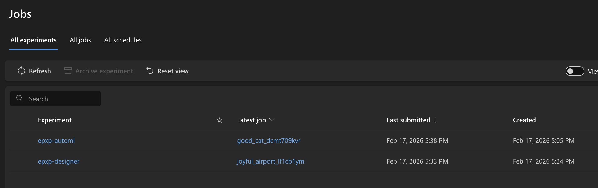
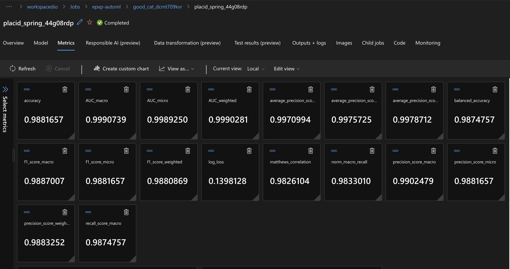
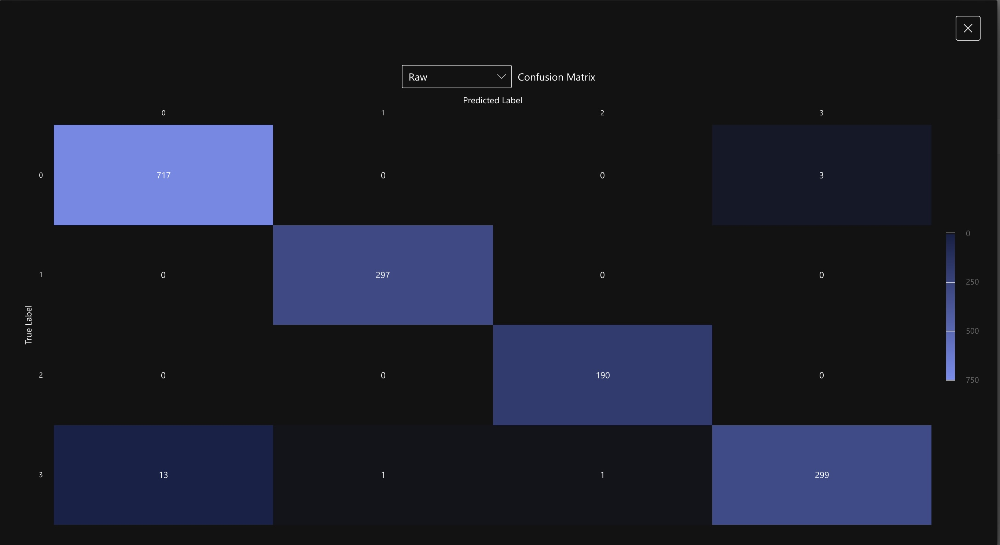
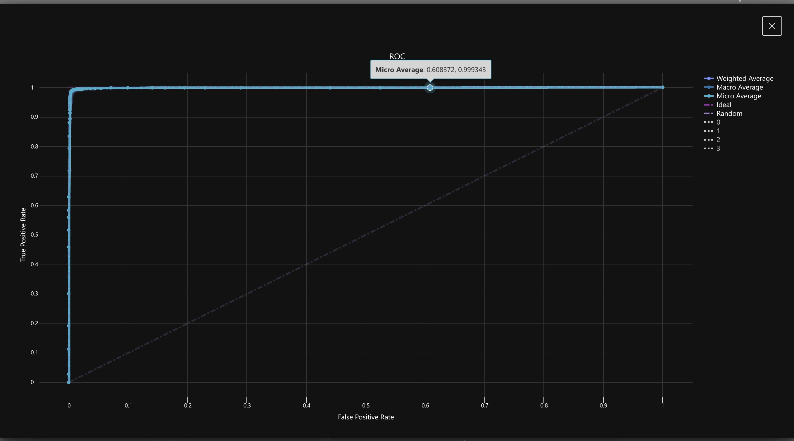
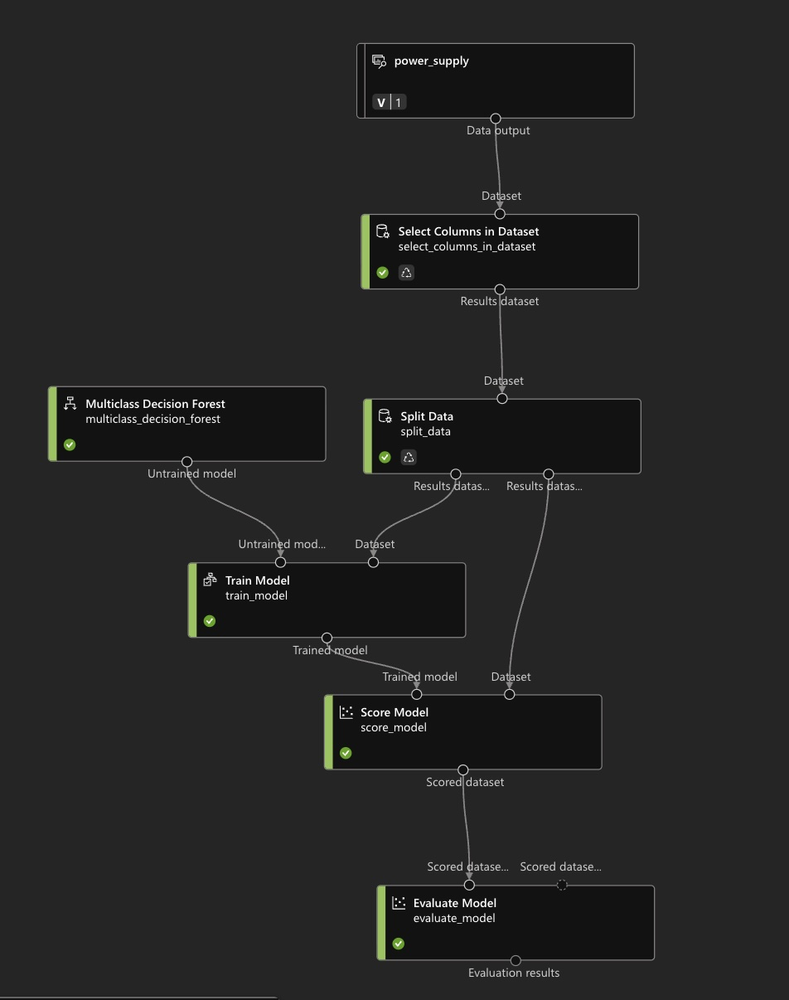

# azureML_DIO

## This repo was created to show up a case of usage of AzureML to process data in a ML Pipeline using the builtin tools.

**For this activity I have decided to use a real data set that I got for my TCC in the MBA of USP Esalq in DSA, what I will briefly explain below**

The data used for this activity what acquired using the DAQ hardware that I have designed I then packaged to be analyzed and processed with ML. Basically my goal on the TCC is to show that it is possible to identify properties of the load based on the behavior of voltage and current supplied by the power supply.

 - DAQ Prototype:

  

 
 - Dataset link:

## 📊 Dataset Preview

Below is a preview of the first five samples extracted from the power supply monitoring dataset.

| state | t_mean | fs_real | V_mean | V_rms | V_var | V_vpp | V_skew | V_kurt | V_f_peak | V_THD | I_mean | I_rms | I_var | I_vpp | I_skew | I_kurt | I_f_peak | I_THD |
|-------|--------|----------|--------|--------|--------|--------|--------|--------|-----------|--------|--------|--------|--------|--------|--------|--------|-----------|--------|
| 0 | 256.1425 | 16949.58 | 4.9676 | 4.9676 | 0.000372 | 0.1012 | 0.1614 | -1.0131 | 59.3235 | 0.3522 | 0.00449 | 0.00648 | 0.000022 | 0.02247 | 0.9156 | 0.1711 | 4889.95 | 0.0000 |
| 0 | 256.2364 | 25564.95 | 4.9737 | 4.9737 | 0.000375 | 0.1051 | 0.0305 | -0.9749 | 51.1299 | 0.3881 | 0.00455 | 0.00665 | 0.000023 | 0.02528 | 1.0075 | 0.4493 | 11120.75 | 0.0000 |
| 0 | 256.3146 | 25580.32 | 4.9734 | 4.9735 | 0.000386 | 0.09084 | -0.0149 | -1.0380 | 51.1606 | 0.5636 | 0.00430 | 0.00643 | 0.000023 | 0.02921 | 1.0610 | 0.6596 | 3159.17 | 0.3807 |
| 0 | 256.3928 | 25578.36 | 4.9736 | 4.9736 | 0.000351 | 0.09477 | -0.0559 | -0.9331 | 51.1567 | 0.4218 | 0.00441 | 0.00643 | 0.000022 | 0.02808 | 0.9427 | 0.2968 | 8287.39 | 0.0000 |
| 0 | 256.4710 | 25564.95 | 4.9731 | 4.9731 | 0.000327 | 0.1108 | 0.0602 | -0.8272 | 51.1299 | 0.4608 | 0.00454 | 0.00662 | 0.000023 | 0.02808 | 0.9971 | 0.5281 | 3898.65 | 0.5541 |

Full dataset available here:  
[Download CSV](./dataset_teste_1771164123.csv)

To execute this DiO lab I have created to kinds of flow, one using the AutoML function and the second using the design function, what I show below:

**OBS: For both methods I have selected the state as output so that I could try to check whether there was correlation between Voltage/Current and the infered load state.**
  

 1. Jobs:

<figure align="center">
  
  <figcaption>
    <strong>Figure 1.</strong> Jobs created for AutoML and Design
  </figcaption>
</figure>

  
     
 2. Auto ML:

<figure align="center">
  
  <figcaption>
    <strong>Figure 2.</strong> Results of the best AutoML Training.
  </figcaption>
</figure>

  

 3. Confusion Matrix:

<figure align="center">
  
  <figcaption>
    <strong>Figure 3.</strong> Confusion Matrix of training results.
  </figcaption>
</figure>

  

 4. ROC Curve:

<figure align="center">
  
  <figcaption>
    <strong>Figure 4.</strong> ROC curve after trainings.
  </figcaption>
</figure>

  

 5. ML designer:

<figure align="center">
  
  <figcaption>
    <strong>Figure 5.</strong> ML designer approach.
  </figcaption>
</figure>

  

As we can see, both of the methods have returned a strong model with really good accuracy and ROC.
